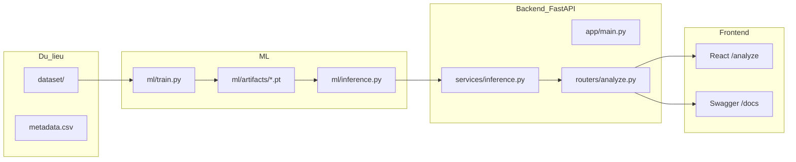

# Hướng dẫn Hình 2.8.5 — Tích hợp mô hình AI vào API (FastAPI)

Tài liệu này ánh xạ mẫu báo cáo mục **2.4.5** (Flask: `train.py`, `predict.py`, `app.py`) sang codebase **mit-smart-system** (FastAPI + React).

## Sơ đồ luồng



## Bảng ánh xạ Hình ↔ File dự án

| Hình | Mẫu báo cáo | Chụp từ đâu |
|------|-------------|-------------|
| **2.8.5.1** | File dữ liệu | `dataset/`, `dataset/DATASET.md`, `dataset/metadata.csv` |
| **2.8.5.2** | `train.py` | `ml/train.py` (hàm `build_model`, vòng `epoch`, lưu `*_best.pt`) |
| **2.8.5.3** | `predict.py` | `ml/inference.py` + `backend/app/services/inference.py` |
| **2.8.5.4** | `app.py` | `backend/app/main.py` + `backend/app/routers/analyze.py` |
| **2.8.5.5** | Test Web 1 | http://localhost:5173/analyze (trước phân tích) hoặc Swagger `/docs` |
| **2.8.5.6** | Test Web 2 | http://localhost:5173/analyze (sau phân tích — hotspot + khuyến nghị) |

---

## Chuẩn bị trước khi chụp

### Terminal 1 — Backend

```powershell
cd D:\mit-smart-system\backend
.\.venv\Scripts\Activate.ps1
python -m uvicorn app.main:app --reload --port 8000
```

### Terminal 2 — Frontend

```powershell
cd D:\mit-smart-system\frontend
npm run dev
```

Mở URL Vite in ra (thường http://localhost:5173 hoặc 5174).

### Dataset (Hình 2.8.5.1)

```powershell
cd D:\mit-smart-system
.\scripts\init_dataset_dirs.ps1
```

Đã có ảnh mẫu trong `dataset/**/train` và `dataset/**/val` (copy từ ảnh upload thử nghiệm). Bổ sung ảnh mít thật của nhóm khi báo cáo chính thức.

### Model (tuỳ chọn)

- Chưa train: caption ghi **chế độ demo / mock inference**.
- Đã train: đặt `MOCK_INFERENCE=false` trong `backend/.env`, có `ml/artifacts/disease_best.pt` và `ripeness_best.pt`.

---

## Chi tiết từng hình

### Hình 2.8.5.1 — File dữ liệu

**Chụp:** VS Code / Explorer — cây thư mục `dataset/disease/train/...`, `dataset/ripeness/train/...`, file `metadata.csv`.

**Caption mẫu:**

> *Hình 2.8.5.1. Cấu trúc thư mục dataset huấn luyện (task disease/ripeness, tập train/val/test theo class).*

---

### Hình 2.8.5.2 — Code train.py

**Chụp:** `ml/train.py` — EfficientNet-B0, vòng huấn luyện, lưu checkpoint (khoảng dòng 21–26 và 104–126).

**Caption mẫu:**

> *Hình 2.8.5.2. Mã nguồn huấn luyện mô hình phân loại (`train.py`) — transfer learning EfficientNet-B0, lưu checkpoint theo accuracy validation.*

**Lệnh train (terminal phụ, tuỳ chọn):**

```powershell
cd D:\mit-smart-system\ml
.\.venv\Scripts\Activate.ps1
pip install -r requirements.txt
python train.py --task disease --data-dir ../dataset/disease --epochs 10
```

---

### Hình 2.8.5.3 — Code predict.py → inference.py

**Chụp 2 panel:**

1. `ml/inference.py` — `predict_single`, `predict_dual`
2. `backend/app/services/inference.py` — `analyze_image`, hotspots

**Caption mẫu:**

> *Hình 2.8.5.3. Module suy luận (`inference.py`): nạp checkpoint, tiền xử lý ảnh 224×224, trả nhãn bệnh và độ chín; tích hợp vào service backend.*

---

### Hình 2.8.5.4 — Code app.py → FastAPI

**Chụp 2 panel:**

1. `backend/app/main.py` — FastAPI, router, `/uploads`, `/health`
2. `backend/app/routers/analyze.py` — `POST /analyze`

**Caption mẫu:**

> *Hình 2.8.5.4. Triển khai API FastAPI: đăng ký router, endpoint `POST /api/v1/analyze` phục vụ upload ảnh và trả kết quả AI cho frontend.*

---

### Hình 2.8.5.5 — Test Web 1

**Chụp:** Trang `/analyze` — đã chọn ảnh preview, sẵn sàng bấm **Chạy phân tích AI** (hoặc Swagger `POST /api/v1/analyze`).

**Caption mẫu:**

> *Hình 2.8.5.5. Giao diện gửi ảnh phân tích qua Web — người dùng chọn ảnh và vườn trước khi gọi API.*

**Lưu ý:** Đăng nhập trước tại `/login`.

---

### Hình 2.8.5.6 — Test Web 2

**Chụp:** Trang `/analyze` sau phân tích — ảnh + vùng màu (xanh/cam/đỏ), chỉ số, khuyến nghị.

**Caption mẫu:**

> *Hình 2.8.5.6. Kết quả phân tích trên Web: vùng ảnh hưởng, mức độ bệnh, độ chín và khuyến nghị xử lý.*

---

## Mẹo chụp cho Word

- Cửa sổ ~1200px rộng; font code 14–16pt.
- Đặt tên file: `Hinh_2_8_5_1_dataset.png` … `Hinh_2_8_5_6_ket_qua.png`.
- Che email/token nhạy cảm.
- Ghi **FastAPI** + **React** trong báo cáo (không ghi Flask nếu không dùng).

## Checklist

| Hình | Đã chụp | Nguồn |
|------|---------|--------|
| 2.8.5.1 | ☐ | `dataset/` |
| 2.8.5.2 | ☐ | `ml/train.py` |
| 2.8.5.3 | ☐ | `ml/inference.py`, `services/inference.py` |
| 2.8.5.4 | ☐ | `main.py`, `analyze.py` |
| 2.8.5.5 | ☐ | `/analyze` hoặc Swagger |
| 2.8.5.6 | ☐ | `/analyze` kết quả |

## Thư mục ảnh báo cáo

Ảnh tham chiếu đã tạo sẵn (code + dataset) trong `docs/figures/2.8.5/`:

```powershell
cd D:\mit-smart-system\backend
.\.venv\Scripts\python.exe ..\scripts\generate_report_figures.py
```

Hình Web 2.8.5.5–2.8.5.6: chạy `.\scripts\capture_web_figures.ps1` rồi chụp màn hình `/analyze` (thay file `*_PLACEHOLDER.png`).

Xem thêm đoạn văn mẫu mục 2.4.5: [BAO_CAO_MUC_2_4_5.md](BAO_CAO_MUC_2_4_5.md).
