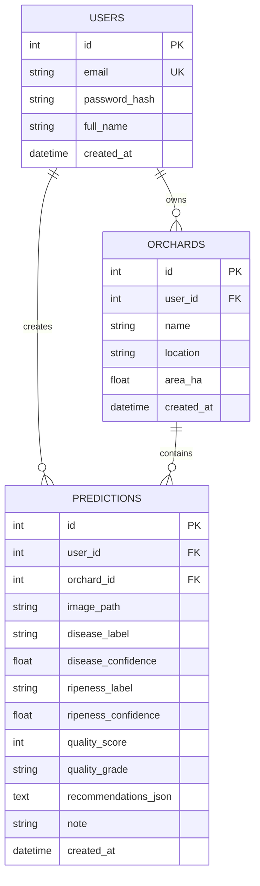

# Thiết kế cơ sở dữ liệu (ERD)

## Sơ đồ quan hệ

## Bảng chi tiết

### `users`

| Cột | Kiểu | Ghi chú |
|-----|------|---------|
| id | INTEGER PK | autoincrement |
| email | VARCHAR(255) UNIQUE | |
| password_hash | VARCHAR(255) | bcrypt |
| full_name | VARCHAR(255) | |
| created_at | DATETIME | UTC |

### `orchards`

| Cột | Kiểu | Ghi chú |
|-----|------|---------|
| id | INTEGER PK | |
| user_id | INTEGER FK → users.id | |
| name | VARCHAR(255) | |
| location | VARCHAR(255) | nullable |
| area_ha | FLOAT | nullable |
| created_at | DATETIME | |

### `predictions`

| Cột | Kiểu | Ghi chú |
|-----|------|---------|
| id | INTEGER PK | |
| user_id | INTEGER FK | |
| orchard_id | INTEGER FK | nullable |
| image_path | VARCHAR(512) | đường dẫn file upload |
| disease_label | VARCHAR(64) | |
| disease_confidence | FLOAT | 0–1 |
| ripeness_label | VARCHAR(64) | |
| ripeness_confidence | FLOAT | |
| quality_score | INTEGER | 0–100 |
| quality_grade | VARCHAR(2) | A/B/C/D |
| recommendations_json | TEXT | JSON array |
| note | TEXT | nullable |
| created_at | DATETIME | index |

## Index đề xuất

- `predictions(user_id, created_at DESC)`
- `predictions(orchard_id, created_at DESC)`

## File DB development

SQLite: `backend/data/mit_system.db`  
Production (optional): PostgreSQL qua `DATABASE_URL`.
